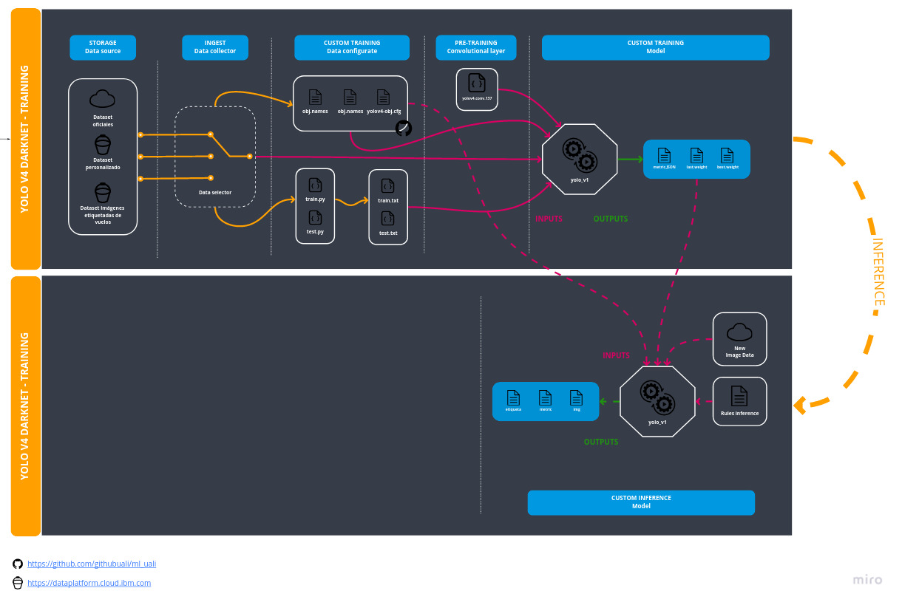

# Machine Learning - UALI

Este repositorio centraliza todo el contenido del proyecto de detección de objetos en imagenes aereas con el uso de CNN.

## Documentación

1. [Planificación general del proyecto (abril_2021)](https://drive.google.com/file/d/1bMuCR1LKOgmpmQsZwPuTdjEPNApDvzgN/view?usp=sharing)
2. [Apunte -Investigación y estudio del estado del arte](https://docs.google.com/document/d/1mygFBACNOq0p7MN__wcEl8sxGZEG187TV8vuhzMOjeU/edit?usp=sharing)
    1. [Resumen de la investigación](https://docs.google.com/spreadsheets/d/1atzYZL8IrZ4RDQQDC8rHAR0ydo9VwBXqHv8p4fDXsVo/edit?usp=sharing)
    2. [Links de interes](https://docs.google.com/document/d/1T_ZZ26vpcQTAqynuSMu--mj9A2ZRGAsa9byyAC6NLPk/edit?usp=sharing)
    
> Toda la documentación se ingresa con permiso.

## Data pipeline

En el siguiente gráfico se presenta el **data flow** pensado para desplegar en [IBM Cloud](https://dataplatform.cloud.ibm.com)

## Notebooks

* [Storage de notebooks](https://drive.google.com/drive/folders/15F2JkUutHZ6INLlFT_il6N-bGxbxq3TJ?usp=sharing)

🔴: Untrained  
🟡: Training  
🟢: Trained  

## Training

Para el entrenamiento se utiliza los servicios de GPU Google/IBM usando el **Notebook training** (Google Drive), finalizado el entrenamiento se guarda el notebook en GitHub.

| Nombre | Modelo | Framework | Pre weights | Custom dataset | Data training | Best weights | Notebook training | MaP | Status | Fecha |
|:--:|:--:|:--:|:--:|:--:|:--:|:--:|:--:|:--:|:--:|:--:|
| [yolo_v1][1] | yoloV4_darknet | [Darknet/AlexeyAB][2] | [yolov4.conv.137][3] | [openImage_v1][4] | [data_training.zip (obj.data-obj.name-.cfg)](training/yolo_v1/data_training.zip) | [yolov4-obj_best.weights](https://drive.google.com/file/d/1-5eprW8D2Si3gZOqaN4QadHOFhvu6OWT/view?usp=sharing) | [][5] | 54% | 🟢 | jun_2021 |

## Modelos

Modelos implementados/pendientes.

| Nombre | Algoritmo | Backbone |  Framework | Status | Fecha |
|:--:|:--:|:--:|:--:|:--:|:--:|
| yoloV4_darknet | [Yolo][6] | [CSPDarknet53][7] | [Darknet/AlexeyAB][2] | 🟢 | jun_2021 |     

## Datasets

Datasets implementados/pendientes, para las *custom layers*.

|  Nombre | Fecha | Origen de imagenes | Categorias (test)(val) | Distribución | Formato | +Info |
|:-------:|:-------:|:-------:|:-------:|:-------:|:-------:|:-------:|
| [openImage_v1][1] | mayo_2021  | [Open Image Dataset V6][2]  | Car(3000)(600) Truck(2916)(254) Person(2902)(584) Vehicle(2968)(463) Van(2825)(112) Motorcycle(2885)(110)  |  train(80%) validation (20%)  | YoloV4-Darknet  |   |   
| [visDrone][3] | junio_2021  | [visDrone2021][4]  | Pedestrian, People, Bicycle, Car, Van, Truck, Tricycle, Awning-tricycle, Bus , Motor, Others  |  train(80%) validation (20%)  | YoloV4-Darknet  | Falta el balance. Buscar en [este trabajo][5]  |

* [Recopilación y etiquetado de un conjunto de datos personalizado](docs/custom_datasets.md)

<!-- links -->
[1]: https://drive.google.com/drive/folders/1RPxQnrn9OMLv4ejEo9PX2VDYn4ynoDks?usp=sharing
[2]: https://storage.googleapis.com/openimages/web/index.html
[3]: https://drive.google.com/drive/folders/1oJ0vg-p2dGxlExGEuK8kAqGQmkdphPDd?usp=sharing
[4]: http://aiskyeye.com/download/
[5]: https://openaccess.thecvf.com/content_ECCVW_2018/papers/11133/Zhu_VisDrone-DET2018_The_Vision_Meets_Drone_Object_Detection_in_Image_Challenge_ECCVW_2018_paper.pdf

### Uso de los datasets

## Inference

Para probar los modelos e inferir resultados no es necesario contar con GPU, se puede ejecutar los notebooks localmente

| Nombre | Notebook | 
|:--:|:--:|
| Yolo | [yolo_inference.ipynb](inference/yolo_inference.ipynb) | 

## API

<!-- links -->
[1]: training/yolo_v1/yolo_v1_trained.ipynb
[2]: https://github.com/AlexeyAB/darknet
[3]: https://github.com/AlexeyAB/darknet/releases/download/darknet_yolo_v3_optimal/yolov4.conv.137
[4]: https://drive.google.com/drive/folders/1RPxQnrn9OMLv4ejEo9PX2VDYn4ynoDks?usp=sharing
[5]: https://colab.research.google.com/drive/1a_jDWLM5hiFwDmD6CZGfxhtl5Biyj501?usp=sharing

[6]: https://colab.research.google.com/drive/1mixbM9j1M7hGIWpmeEikW0_-dmV_o3R0?usp=sharing
[7]: https://paperswithcode.com/method/cspdarknet53
[8]: https://github.com/AlexeyAB/darknet/releases/download/darknet_yolo_v3_optimal/yolov4.weights
[9]: https://github.com/AlexeyAB/darknet
[10]: https://paperswithcode.com/method/cspdarknet53
[11]: https://www.cv-foundation.org/openaccess/content_cvpr_2016/papers/Redmon_You_Only_Look_CVPR_2016_paper.pdf

<!-- links -->
[1]: https://drive.google.com/drive/folders/1RPxQnrn9OMLv4ejEo9PX2VDYn4ynoDks?usp=sharing
[2]: https://storage.googleapis.com/openimages/web/index.html
