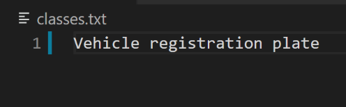

# Recopilación y etiquetado de un conjunto de datos personalizado

Para crear un detector de objetos personalizado, se necesita un buen conjunto de datos de imágenes y etiquetas para que el detector pueda entrenarse de manera eficiente.

Esto se puede hacer de dos formas. 

1. Mediante el uso de imágenes de Google ya etiquetadas.
2. La creación de su propio conjunto de datos y el uso de una herramienta de anotación para dibujar etiquetas manualmente (por ejemplo [labelImg](https://github.com/tzutalin/labelImg)). 

## 1. [Etiquetado manual de imagenes usando RoboFlow](https://github.com/githubuali/label_ml_uali)

## 2. Uso del conjunto de datos de imágenes abiertas de Google 

Con este método se puede recopilar miles de imágenes y generar automáticamente sus etiquetas en minutos. Recopilar un conjunto de datos del conjunto de datos de imágenes abiertas de Google y usar el kit de herramientas [OIDv4](https://github.com/theAIGuysCode/OIDv4_ToolKit) para generar etiquetas es fácil y eficiente en el tiempo. ¡El conjunto de datos contiene imágenes etiquetadas para más de 600 clases! [¡Explore el conjunto de datos Open Images Dataset V6 aquí!](Https://storage.googleapis.com/openimages/web/index.html)

Referencia:
[Creación de un conjunto de datos YOLOv3 personalizado (video)](https://www.youtube.com/watch?v=_4A9inxGqRM) **(las imágenes y las etiquetas tienen el mismo formato para YOLOv4)**

### Getting started

Clonar repositorio en una carpeta local
``` bash
git clone https://github.com/theAIGuysCode/OIDv4_ToolKit.git
```

Crear un entorno virtual
``` bash
python3 -m venv OID
```

Activar entorno virtual
``` bash
source OID/bin/activate # activa el entorno virtual
```

Otros comandos
``` bash
deactivate # desactiva el entorno virtual
rm -r env # eliminar el entorno virtual
```

Instalar librerias

``` bash
pip3 install -r requirements.txt
```

### Conjunto de datos para entrenamiento (train)

Buscar clases que se desean en: https://storage.googleapis.com/openimages/web/index.html

Por ejemplo: Car, Truck y Person

``` bash
python3 main.py downloader --classes Car Truck Person --type_csv train --limit 3000 --multiclasses 1
```

Notas: 
* `--multiclasses 1` guardar todas sus imágenes de entrenamiento juntas en una carpeta.
* Las clases con nombres compuestos agregar guión bajo (_) o doble comilla ("") para usar el nombre de la clase sin guión.

Esto crea una carpeta con 3000 imágenes de 'Car Truck Person' en una misma carpeta (OID/Dataset). Atención en el caso que la categoria no tenga esa cantidad de imagenes, descargara la cantidad máxima disponible.

### Conjunto de datos de validación (validation)

**Nota:** Tener un conjunto de datos de validación es opcional pero muy recomendable.

Queremos tener un conjunto de datos de validación para probar correctamente nuestro detector de objetos personalizado después de que esté entrenado. Podemos aprovechar el OIDv4_Toolkit ya que tiene imágenes separadas para la validación para asegurarnos de que tenemos diferentes imágenes y no las que están en nuestro conjunto de datos de entrenamiento.

Podemos ejecutar los mismos comandos anteriores pero para validación. Recomiendo tener un tamaño de conjunto de datos de validación que sea aproximadamente del 20 al 30% del tamaño de su conjunto de datos de entrenamiento.
Como elegí 3000 imágenes para mis datos de entrenamiento, esto significa que tendré un tamaño de validación de 600 imágenes. (20% de 3000 = 600)

``` bash
python main.py downloader --classes Car Truck Person --type_csv validation --limit 600 --multiclasses 1
```

### Conversión de etiquetas al formato YOLOv4

Las etiquetas que obtenemos del kit de herramientas no están en el formato YOLOv4 adecuado. Afortunadamente, con unos pocos comandos simples podemos convertirlos al formato adecuado.

Dentro de la carpeta raíz OIDv4_ToolKit, abra el archivo **classes.txt** y edítelo para tener las clases que acaba de descargar, una por línea.



Un ejemplo de **classes.txt** para detectar multiclases:


Ahora ejecute este comando para convertir las etiquetas generadas por OIDv4_Toolkit en etiquetas YOLOv4 (esto debería convertir las etiquetas del conjunto de datos de validación y de entrenamiento):

``` bash
python3 convert_annotations.py
```

Esto convierte todas las etiquetas al formato YOLOv4 que ahora puede ser utilizado por darknet para entrenar adecuadamente nuestro detector de objetos personalizado.

Elimine la antigua carpeta'Label' en las carpetas train y validation que contiene las etiquetas no formateadas YOLOv4 ejecutando lo siguiente: (su path file tendra un nombre diferente 'Vehicle registration plate'... dependiendo de la clase que haya bajado.

``` bash
rm -r OID/Dataset/train/'Vehicle registration plate'/Label/
```

Y finalmente elimine también las etiquetas antiguas para validation.

``` bash
rm -r OID/Dataset/validation/'Vehicle registration plate'/Label/
```

Si este comando no funciona en su máquina, simplemente vaya a la carpeta 'Label' y haga clic derecho y presione Eliminar para eliminarlo manualmente.

Las carpetas con todas sus imágenes y anotaciones ahora deberían verse así. Cada imagen debe tener un archivo de texto con el mismo nombre al lado (o debajo).


### Almacenamiento del nuevo dataset

Extraer las carpetas creadas del nuevo dataset ubicadas en: 

*   OID/Dataset/train/
*   OID/Dataset/validation/

Crear una carpeta con los dataset comprimidos (en carpetas separadas), asignarle un nombre al conjunto de dataset. Agregar un archivo README.md y almacenarlo en:

[carpeta de *trial_custom_datasets*](https://drive.google.com/drive/folders/1zrvJLeeatbOYWB1CfjX0wxGsAbtfmqoL?usp=sharing)


